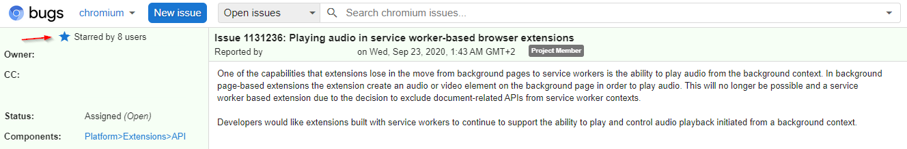

# 2020-12-13 Feature at risk! Playing podcast on the background

Hello **podStation community**!

Apologies if this page jumped in your screen out of nowhere, this page is open automatically when podStation updates to version 1.32.2.

There is one important feature of podStation that is at risk.

I'll explain below what is happening and what you can do about it.

## What is the feature that is at risk?

The possibility of **playing podcasts in the background** (when there is no open tab of podStation) will possibly have to me removed in the near future.

## Why?

Chrome is rolling out the version 3 of its manifest for chrome extensions (MV3).

The current version (2) is still valid, but eventually it will be sunset, and extensions (such as podStation) will need to adapt.

One key change is the deprecation of background pages in favour of Service Workers. Currently the podcasts are played in the extension's background page, so that you can close all podStation tabs and still listen to your podcast. Playing audio from Service Workers is not supported.

## What can you do about it?

There is an open issue in chromium's bug tracker about this topic: <http://crbug.com/1131236>

You can help bring attention to it by _starring_ it (you will need to sign in to this platform):

## References

- [podStation Issue #125 - Migration to MV3](https://github.com/podStation/podStation/issues/125)
