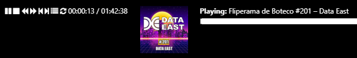
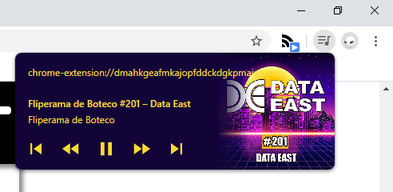

# v1.21.0 - Release Notes

Hello podStation user!

Here is what is new.

## Fixed bugs

### The episode thumbnail is back on the player!  

This is a fix for issue [#50](https://github.com/podStation/podStation/issues/50) (github).  
You may have noticed this feature disappeared some time ago, but now it is bac:

## New features

### MediaSession support for metadata and controls

This is an implementation for feature [#38](https://github.com/podStation/podStation/issues/38) (github)

Have you seen the new cool feature on Google Chrome where you can see and control all media from a button on the toolbar (global media controls).  
This feature was recently introduced on the desktop versions of the browser and I could not wait to support it!

Enjoy:

