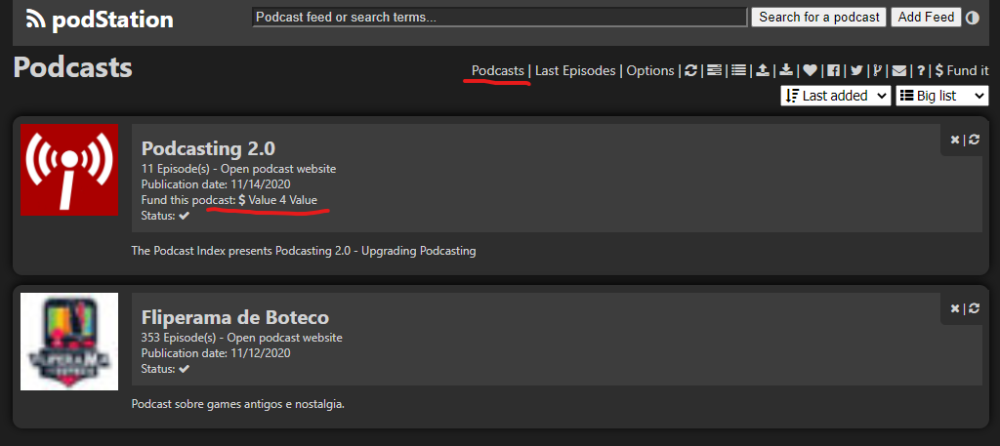

# v1.26.0 - Release Notes

Hello podStation user!

Here is what is new.

## New features

### Support for `<podcast:funding>`

[Issue #159](https://github.com/podStation/podStation/issues/159)

With this release we implemented support for the `<podcast:funding>` tag on RSS feeds for podcasts.

Podcasts that use this tag on their feed will now show a link to its funding platform.

By the way, did you know if you can fund the development of podStation?

Send us the amount you think it is worth for you [here](https://www.paypal.com/cgi-bin/webscr?cmd=_s-xclick&hosted_button_id=DEQFCARLYBXXE).